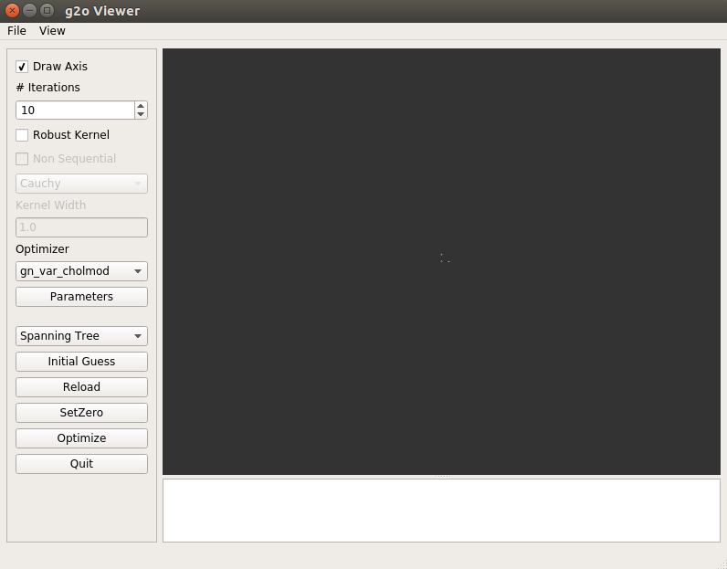
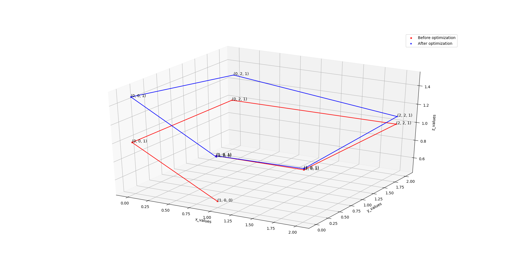

# G2O viewer docker


## Installation
```
## Build docker image
bash build.sh

## Start docker container
bash run.sh
```

## Play with example
1. Type `g2o_viewer` after login into docker container
2. The following window will pop-up 
3. Put `test.g2o` to `~/docker_share`
4. File > Load and open test.g2o file
5. Press Optimize and see if anything changed

